<h1 align="center"><strong>Advanced Web Project: Student Management</strong>  </h1>

<h2>Thông tin cá nhân</h2>

👤 **Họ tên:** Nguyễn Duy Hiệu  
🎓 **Mã sinh viên:** 23010363

## 📝 Mô tả dự án

Website quản lí sinh viên với các chức năng cơ bản
Dự án sử dụng Laravel, MySQL, và tích hợp hệ thống gửi mail định kỳ.

## 🧰 Công nghệ sử dụng

-   PHP (Laravel Framework)
-   Laravel Breeze
-   MySQL (Aiven Cloud)
-   Blade Template
-   Tailwind CSS (do Breeze tích hợp sẵn)
-   Bootstrap

## 🚀 Cài đặt & Chạy thử

```bash
git https://github.com/NguyenDuyHieu49/AdvancedWeb/tree/master
cd ./quan-ly-sinh-vien
composer install
npm i
cp .env.example .env
php artisan key:generate
php artisan migrate
```

<p>
Hãy tạo 1 server SQL trên Aiven để có thể dùng trong dự án hoặc tự tạo 1 server với xampp hoặc docker trên máy tính cá nhân của bạn  
</p>
<strong>
Sau dó chạy 2 câu lệnh ở 2 terminal khác nhau
</strong>

```bash
php artisan serve
npm run dev
```
# Sơ đồ khối

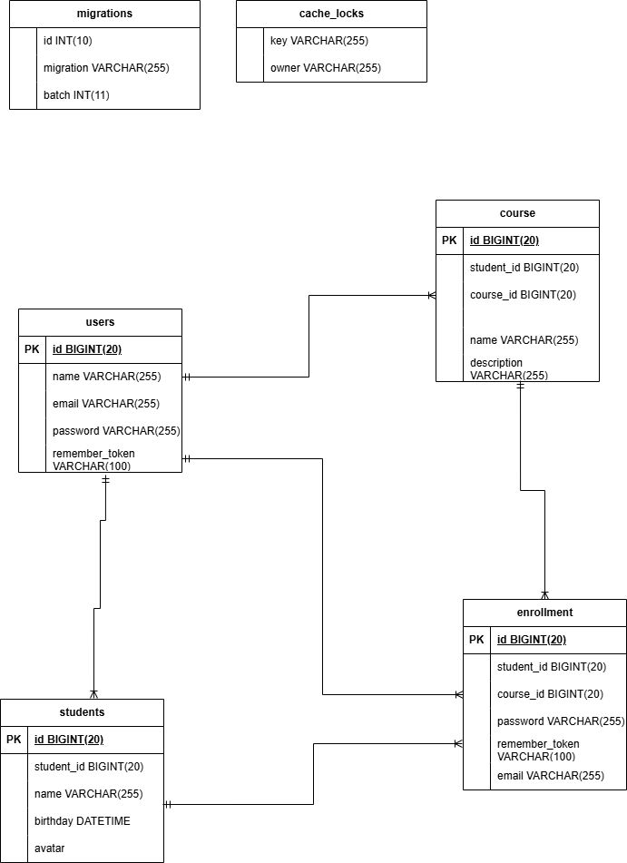

## ⚙️Sơ đồ chức năng

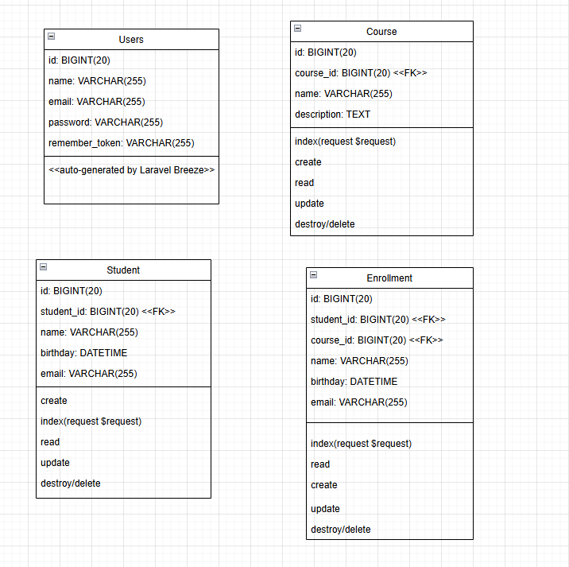

## 🧠Sơ đồ thuật toán

<strong>Dasboard</strong>  
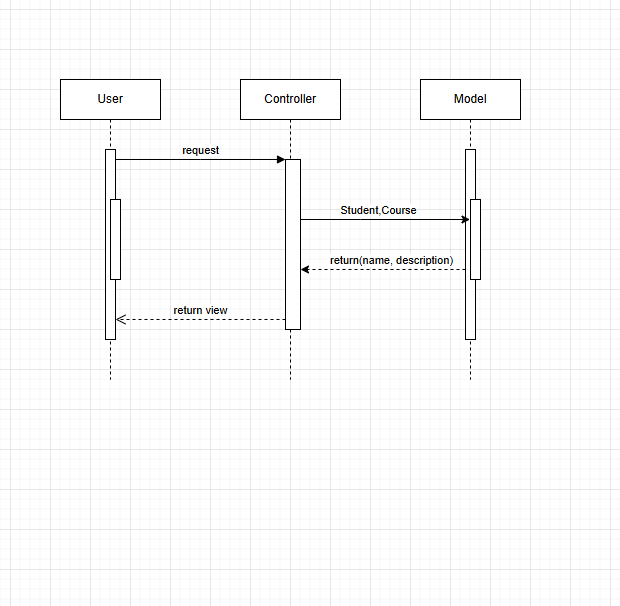

<strong>CRUD Student</strong>  
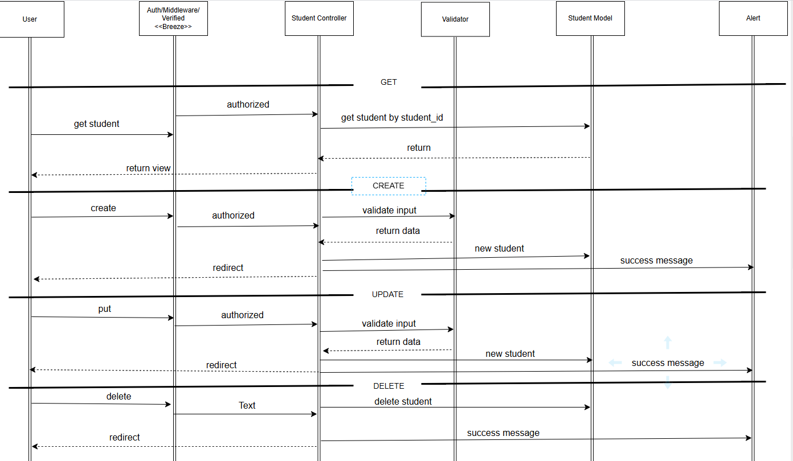


# Một số Code chính minh họa

## Model
<strong>Student Model</strong>

```php
class Student extends Model
{
    use HasFactory;

    protected $fillable = ['name', 'email', 'birthday', 'avatar'];

    public function enrollments()
    {
        return $this->hasMany(Enrollment::class);
    }

    public function courses()
    {
        return $this->belongsToMany(Course::class, 'enrollments');
    }
}
```
<strong>Course Model</strong>
```php
class Course extends Model
{
    use HasFactory;

    protected $fillable = ['name', 'description'];

    public function enrollments()
    {
        return $this->hasMany(Enrollment::class);
    }

    public function students()
    {
        return $this->belongsToMany(Student::class, 'enrollments');
    }
}

```

<strong>Course Model</strong>
```php
class Enrollment extends Model
{
    use HasFactory;

    protected $fillable = ['student_id', 'course_id'];

    public function student()
    {
        return $this->belongsTo(Student::class);
    }

    public function course()
    {
        return $this->belongsTo(Course::class);
    }
}
```
## Controller

<strong>Course Controller</strong>

```php
class CourseController extends Controller
{
    /**
     * Display a listing of the resource.
     */
    public function index()
    {
        //
    }

    /**
     * Show the form for creating a new resource.
     */
    public function create()
    {
        //
    }

    /**
     * Store a newly created resource in storage.
     */
    public function store(Request $request)
    {
        //
    }

    /**
     * Display the specified resource.
     */
    public function show(Course $course)
    {
        //
    }

    /**
     * Show the form for editing the specified resource.
     */
    public function edit(Course $course)
    {
        //
    }

    /**
     * Update the specified resource in storage.
     */
    public function update(Request $request, Course $course)
    {
        //
    }

    /**
     * Remove the specified resource from storage.
     */
    public function destroy(Course $course)
    {
        //
    }
}
```

<strong>Student Controller</strong>
```php
class StudentController extends Controller
{
    public function __construct()
    {
        $this->middleware('auth');
    }

    public function index()
    {
        $students = Student::all();
        return view('students.index', compact('students'));
    }

    public function create()
    {
        return view('students.create');
    }

    public function store(Request $request)
    {
        $validated = $request->validate([
            'name' => 'required',
            'email' => 'required|email|unique:students',
            'birthday' => 'nullable|date',
            'avatar' => 'nullable|image|mimes:jpg,jpeg,png,gif|max:2048',
        ]);
        if ($request->hasFile('avatar')) {
            $path = $request->file('avatar')->store('avatars', 'public');
            $validated['avatar'] = $path;
        }
        Student::create($validated);
        return redirect()->route('students.index')->with('success', 'Thêm sinh viên thành công!');
    }

    public function show(Student $student)
    {
        return view('students.show', compact('student'));
    }

    public function edit(Student $student)
    {
        return view('students.edit', compact('student'));
    }

    public function update(Request $request, Student $student)
    {
        $validated = $request->validate([
            'name' => 'required',
            'email' => 'required|email|unique:students,email,'.$student->id,
            'birthday' => 'nullable|date',
            'avatar' => 'nullable|image|mimes:jpg,jpeg,png,gif|max:2048',
        ]);
        if ($request->hasFile('avatar')) {
            // Xóa ảnh cũ nếu có
            if ($student->avatar) {
                Storage::disk('public')->delete($student->avatar);
            }
            $path = $request->file('avatar')->store('avatars', 'public');
            $validated['avatar'] = $path;
        }
        $student->update($validated);
        return redirect()->route('students.index')->with('success', 'Cập nhật sinh viên thành công!');
    }

    public function destroy(Student $student)
    {
        if ($student->avatar) {
            Storage::disk('public')->delete($student->avatar);
        }
        $student->delete();
        return \redirect()->route('students.index')->with('success', 'Xóa sinh viên thành công!');
    }
}

```

<strong>Enrollment Controller</strong>
```php
class EnrollmentController extends Controller
{
    /**
     * Display a listing of the resource.
     */
    public function index()
    {
        //
    }

    /**
     * Show the form for creating a new resource.
     */
    public function create()
    {
        //
    }

    /**
     * Store a newly created resource in storage.
     */
    public function store(Request $request)
    {
        //
    }

    /**
     * Display the specified resource.
     */
    public function show(Enrollment $enrollment)
    {
        //
    }

    /**
     * Show the form for editing the specified resource.
     */
    public function edit(Enrollment $enrollment)
    {
        //
    }

    /**
     * Update the specified resource in storage.
     */
    public function update(Request $request, Enrollment $enrollment)
    {
        //
    }

    /**
     * Remove the specified resource from storage.
     */
    public function destroy(Enrollment $enrollment)
    {
        //
    }
}
```

<strong>Profile Controller</strong>
```php
class ProfileController extends Controller
{
    /**
     * Display the user's profile form.
     */
    public function edit(Request $request): View
    {
        return view('profile.edit', [
            'user' => $request->user(),
        ]);
    }

    /**
     * Update the user's profile information.
     */
    public function update(ProfileUpdateRequest $request): RedirectResponse
    {
        $request->user()->fill($request->validated());

        if ($request->user()->isDirty('email')) {
            $request->user()->email_verified_at = null;
        }

        $request->user()->save();

        return Redirect::route('profile.edit')->with('status', 'profile-updated');
    }

    /**
     * Delete the user's account.
     */
    public function destroy(Request $request): RedirectResponse
    {
        $request->validateWithBag('userDeletion', [
            'password' => ['required', 'current_password'],
        ]);

        $user = $request->user();

        Auth::logout();

        $user->delete();

        $request->session()->invalidate();
        $request->session()->regenerateToken();

        return Redirect::to('/');
    }
}
```

## View

<strong>
    Cấu trúc chính của view
</strong>
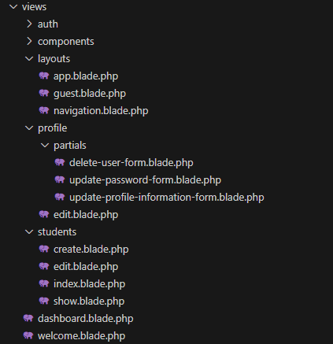

<strong>
    Sử dụng thư viện Tailwind CSS để viết các style trực tiếp trong class mà không cần viết CSS thuần
</strong>

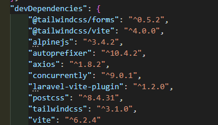
# Security Setup

<strong>
    Sử dụng @csrf để chống tấn công CSRF
    Ví dụ: file /create.blade.php
</strong>

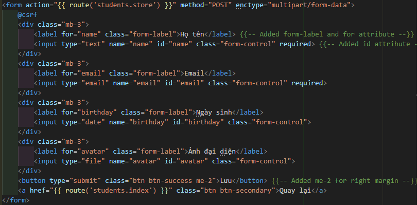

<strong>
    Chống tấn công XSS  
    Ví dụ: file /index.blade.php
</strong>

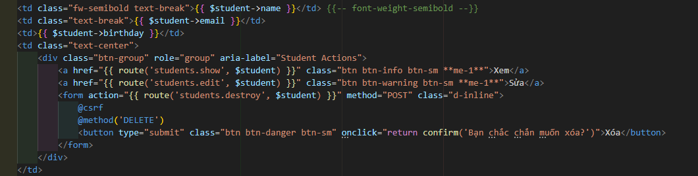

<strong>Trường hợp không xử dụng {{}} của laravel các dữ liệu của chúng ta sẽ không được bảo vệ  </strong>

<strong>
    Validation Ràng buộc dữ liệu giúp ngăn chặn các input độc hại<br>
    Ví dụ method StudentController
</strong>

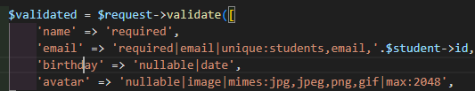

<strong>
    Middleware bảo mật
    Xử dụng các middleware auth, verified, throttle của laravel
    Ví dụ: file routes/web.php
</strong>

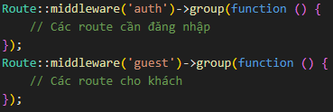  

 Authentication
    Ví dụ: Sử dụng Auth() để lấy thông tin user 1 cách an toàn
    method:StudentController
</strong>

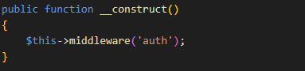

<strong>
    Luôn sử dụng phiên bản Laravel mới nhất để đảm bảo ứng dụng nhận được các bản vá bảo mật, cải tiến hiệu năng và các tính năng mới nhất từ cộng đồng phát triển
</strong>

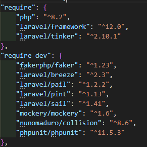


# Link

## Github link

`https://github.com/NguyenDuyHieu49/AdvancedWeb/tree/master`

## Github page

`https://nguyenduyhieu49.github.io/AdvancedWeb/`

## Youtube link


## Public Web (deployment) link


# Một số hình ảnh chức năng chính

## Xác thực người dùng <\<Breeze>\>

<strong>Trang đăng nhập</strong>

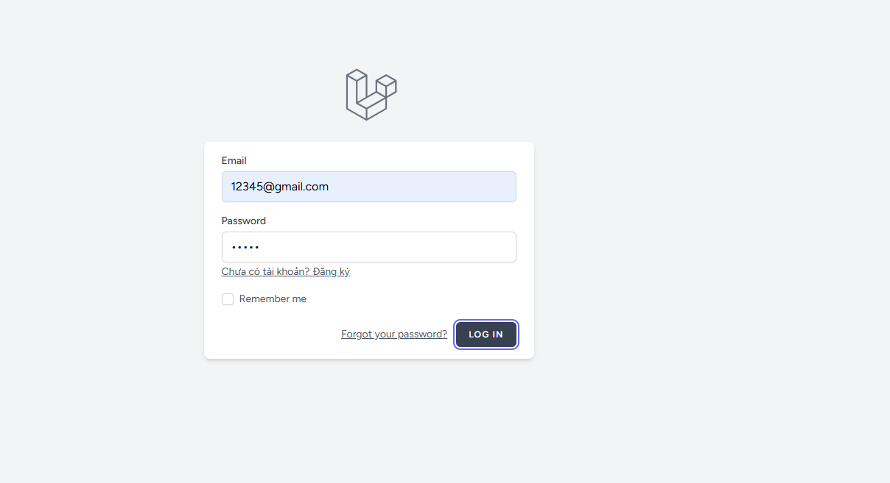

<strong>Trang đăng ký</strong>

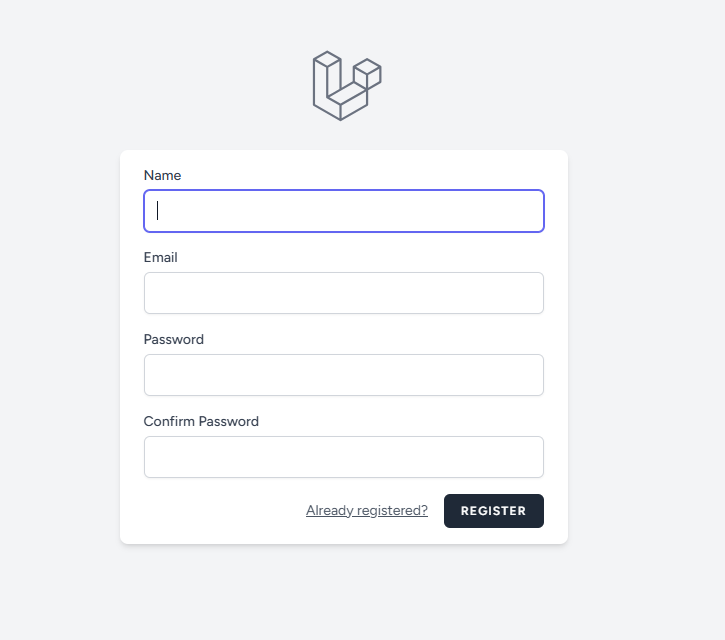

## Trang chính

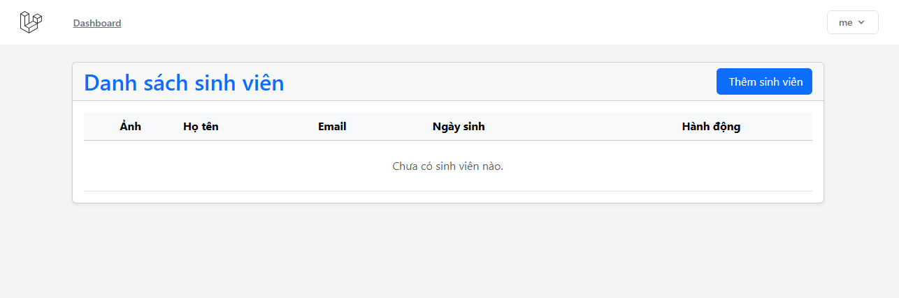

<strong>Sau khi thêm sinh viên</strong>

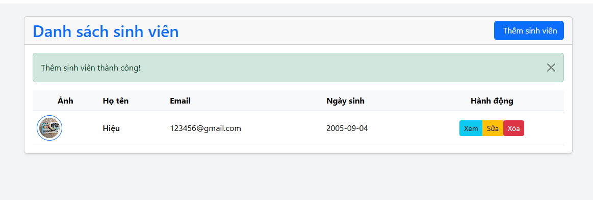

## CRUD Student

<strong>Create Student</strong>

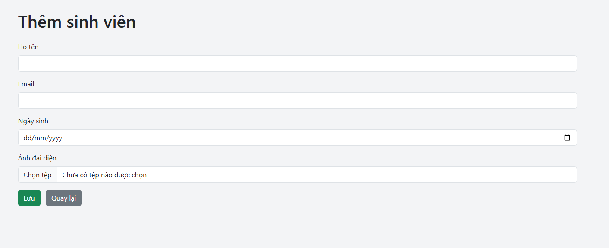

<strong>Delete and update student</strong>

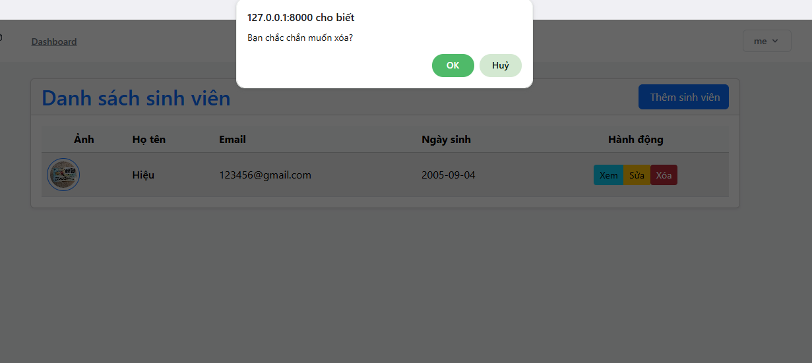

<strong>Trang update</strong>


## Điểm hạn chế
- Không có chức năng phân quyền
- Không có chức năng tìm kiếm
- Không có chức năng phân loại
- Không có chức năng phân tích dữ liệu
- Mới chỉ có thực hiện chức năng với Student, chưa có chức năng với Course và Enrollment
- Giao diện còn đơn giản

# License & Copy Rights

The Laravel framework is open-sourced software licensed under the [MIT license](https://opensource.org/licenses/MIT).
